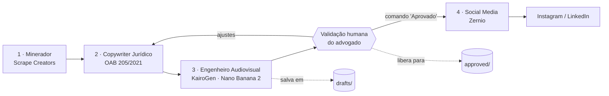

# Esteira Autônoma de Conteúdo Jurídico

Automação multiagente de criação, geração gráfica e agendamento de conteúdo para redes sociais (Instagram/LinkedIn), baseada no ecossistema **GrokBot + Scrape Creators + KairoGen + Zernio** e adaptada à conformidade da advocacia (**OAB — Provimento 205/2021**), com **validação humana obrigatória** antes de qualquer publicação.

> Arquitetura de referência: vídeo *"GrokBot + KAIROGEN + Zernio = Suas redes sociais 100% no Automático (GUIA COMPLETO)"* — canal Gabriel Adamuchi (IA Fácil).

## Visão geral do fluxo



Nenhum conteúdo chega ao agendamento sem o comando explícito **"Aprovado"** do advogado — esse é o ponto de controle (human-in-the-loop) que sustenta a responsabilidade técnica jurídica da esteira.

## O ecossistema de ferramentas

| Ferramenta | Papel na esteira | Link |
|---|---|---|
| **GrokBot (xAI)** | Plataforma de agentes em ambiente Linux onde os 4 bots conversam entre si e fazem handoff automático de dados | Templates: Minerador `x.ai/bot/ut8BU...` · Copywriter `x.ai/bot/DlOMT...` · Audiovisual `x.ai/bot/w1pUF...` · Social Media `x.ai/bot/4vmlC...` *(links completos na descrição do vídeo de referência)* |
| **Scrape Creators** | API de varredura/scraping de redes sociais e busca de pautas e notícias em alta | <https://scrapecreators.com/> |
| **KairoGen** | Hub de geração visual via protocolo **MCP**; modelo-chave **"Nano Banana 2"** (renderiza textos nítidos dentro das imagens) | <https://kairogen.ai/> |
| **Zernio** | Gestão e postagem automática multicanal (Instagram, TikTok, LinkedIn, X) | <https://zernio.com/> |

## Roteiro de configuração do ambiente

### Passo 1 — Instalações globais e CLI

Verifique/instale os pré-requisitos:

```bash
node -v            # exige v18+  → https://nodejs.org
python3 --version  # exige 3.10+ → https://python.org

# Claude Code CLI (se necessário)
npm install -g @anthropic-ai/claude-code
```

Se estiver começando do zero (fora deste repositório), crie a pasta do projeto:

```bash
mkdir esteira-conteudo-juridico && cd esteira-conteudo-juridico
```

Neste repositório a pasta já existe — basta rodar o setup:

```bash
cd esteira-conteudo-juridico
bash setup.sh
```

O `setup.sh` valida os pré-requisitos, garante as pastas de trabalho e cria o `.env` e o `.mcp.json` locais a partir dos exemplos em `config/`.

### Passo 2 — Estrutura de pastas

| Pasta | Conteúdo |
|---|---|
| `prompts/` | Arquivos `.txt` com as diretrizes de cada um dos 4 agentes (para colar no GrokBot) |
| `config/` | `.env.example` (credenciais), `mcp.example.json` (rotas MCP) e `kairogen.visual.json` (padrão visual das artes) |
| `drafts/` | Artes geradas pelo Engenheiro Audiovisual **aguardando aprovação** do advogado |
| `approved/` | Lotes **validados** pelo advogado, prontos para publicação via Zernio |

### Passo 3 — Chaves e credenciais (`.env`)

Copie `config/.env.example` para `.env` (o `setup.sh` já faz isso) e preencha:

| Variável | Onde obter |
|---|---|
| `SCRAPE_CREATORS_API_KEY` | Dashboard do [Scrape Creators](https://scrapecreators.com/) |
| `KAIROGEN_MCP_TOKEN` | Autenticação do MCP no [KairoGen](https://kairogen.ai/) via Device Flow (tela *"Verifying Code"*) |
| `ZERNIO_API_KEY` | Configurações da conta no [Zernio](https://zernio.com/) |
| `INSTAGRAM_ACCOUNT_ID` | ID da conta do Instagram conectada dentro do Zernio |

**Nunca versione o `.env`** — ele já está no `.gitignore`. Se alguma chave vazar (colada em chat, print etc.), revogue e gere outra no dashboard correspondente.

### Passo 4 — Rotas MCP (KairoGen)

O `config/mcp.example.json` traz a rota do servidor MCP do KairoGen autenticada pelo token do ambiente. A URL do exemplo é um ponto de partida: **confirme o endpoint exato exibido no dashboard do KairoGen** ao concluir o Device Flow e ajuste o seu `.mcp.json` local (ou o campo de MCP nas configurações do GrokBot). O modelo deve ser **Nano Banana 2** — os parâmetros visuais padrão (4:5, 1080x1350, preset Rembrandt) estão em `config/kairogen.visual.json`.

## Os 4 agentes

Cole o conteúdo de cada arquivo nas **diretrizes** do bot correspondente no GrokBot:

| Arquivo | Agente | Função | Handoff para |
|---|---|---|---|
| `prompts/01_minerador.txt` | Minerador de Conteúdo Jurídico | Varre portais jurídicos (TJ-BA, STJ, STF) e canais de segurança digital; seleciona os 5 temas mais relevantes das últimas 24h | Copywriter |
| `prompts/02_copywriter.txt` | Copywriter Jurídico de Elite | Transforma o tema em carrossel de 5–7 slides + legenda, dentro das regras do Provimento 205/2021 | Engenheiro Audiovisual |
| `prompts/03_engenheiro_audiovisual.txt` | Engenheiro Audiovisual Jurídico | Gera as artes no KairoGen (Nano Banana 2), salva em `drafts/` e **para, aguardando aprovação humana** | Social Media (só após "Aprovado") |
| `prompts/04_social_media.txt` | Social Media | Agenda a publicação via Zernio nos horários de maior engajamento e confirma data/horário/canais | — |

## Regra de ouro — validação humana (human-in-the-loop)

1. O Engenheiro Audiovisual **nunca** envia artes direto para agendamento.
2. Todo lote gerado fica em `drafts/` e dispara o alerta: **"LOTE GERADO. AGUARDANDO VALIDAÇÃO E APROVAÇÃO HUMANA DO ADVOGADO"**.
3. O advogado revisa os slides e a legenda (conteúdo, tom, fontes citadas, conformidade OAB).
4. Somente o comando explícito **"Aprovado"** libera o lote: ele vai para `approved/` e segue para o agente Social Media agendar no Zernio.
5. O Social Media **recusa** qualquer lote que chegue sem o status de aprovação.

## Conformidade — OAB Provimento 205/2021

Regras embutidas no prompt do Copywriter e que valem para toda a esteira:

**Proibido:**
- Expressões mercantilistas e promessa de resultado/"causa ganha";
- Incitar litígios ou ofertar serviços ativamente;
- Divulgar preços/honorários;
- CTAs de captação de clientela ("Fale conosco", "Contrate um advogado", "Garanta seus direitos").

**Obrigatório:**
- Tom estritamente **informativo, educativo, sóbrio e preventivo**;
- Citação de fontes e da legislação aplicável na legenda;
- Estética discreta e profissional (padrão visual sóbrio definido em `config/kairogen.visual.json`).

> A revisão final de conformidade é sempre do advogado responsável — a etapa de aprovação humana existe exatamente para isso e não deve ser removida da esteira.

## Rotina diária sugerida

1. **Manhã** — Minerador varre as fontes e entrega o relatório dos 5 temas ao Copywriter.
2. Copywriter estrutura o carrossel do melhor tema e faz o handoff ao Engenheiro Audiovisual.
3. Engenheiro Audiovisual gera as artes em `drafts/` e emite o alerta de validação.
4. **Advogado revisa** e responde "Aprovado" (ou pede ajustes, devolvendo ao Copywriter).
5. Social Media agenda no Zernio e confirma no chat data, horário e canais programados.
